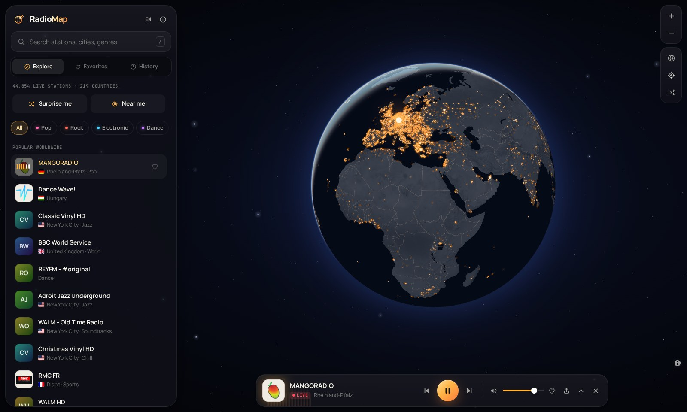
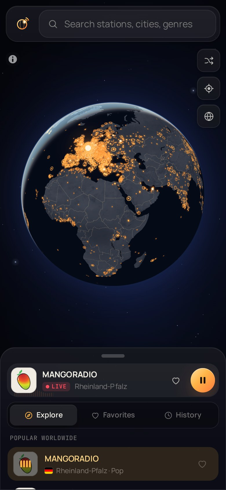

# RadioMap

**Live radio from every corner of the planet.** Spin a night-time globe, click a glowing city and listen to what's on air there right now.

**[radiomap.vercel.app](https://radiomap.vercel.app)**



<p align="center"></p>

## Features

- **A real 3D globe in colour.** WebGL rendering (MapLibre GL) over satellite imagery with 3D terrain: every city with radio stations glows, brighter where there are more of them. Zoom all the way down to streets (satellite + roads + labels), tilt into 3D with the `3D` button.
- **Radio passport (gamification).** Every new country, city and genre you tune into earns XP and a stamp; level up, unlock achievements, see visited cities ringed on the globe, and hit *Fly somewhere new* for a station in a country you haven't heard yet.
- **~45,000 stations, ~6,500 places, 219 countries.** Duplicates are merged, and every station that can be located is placed in its city or region.
- **Instant search** across stations, cities, regions, countries and genres. It ignores accents and works in English and Russian ("jazz berlin", "москва", "sao paulo").
- **Genre filter on the globe.** Pick *Jazz* and only the cities playing jazz stay lit, in the genre's colour.
- **A player that copes with real-world streams.** It handles HLS streams (via a lazily loaded hls.js), reconnects when a stream drops, and fetches a fresh stream URL when the stored one has gone stale. When a station fails it says why and offers the next one.
- **Live spectrum visualiser** on streams that allow it (CORS), and a calm ambient animation on the rest. The station on air pulses on the globe with the music.
- **What's playing now.** The current track is read from the stream's ICY metadata, with links to find it on YouTube Music, Spotify or Apple Music.
- **Favourites and history**, stored in the browser, with import/export. Favourites from the previous version of RadioMap are picked up automatically.
- **Explore around you:** popular stations in the visible part of the map, nearby places, "Surprise me", "Near me" and similar stations.
- **Phone-friendly.** A draggable bottom sheet, lock-screen / headphone controls (Media Session API), and it can be added to the home screen.
- **Keyboard shortcuts:** `Space` play/pause · `/` search · `N`/`P` next/previous · `R` random · `F` favourite · `M` mute · `↑`/`↓` volume · `?` help.
- **Shareable links:** `?station=<id>` opens a station, ready to play.
- English and Russian UI (detected automatically, switchable). Map labels follow the UI language.

## How it works

The browser never talks to a database at load time. Station data is prepared ahead of time and shipped as three static, content-hashed, immutable-cached JSON files:

| File | Size (brotli) | Contents |
| --- | --- | --- |
| `public/data/places.*.json` | ~130 KB | Every dot on the globe — loaded first, so the globe is interactive straight away |
| `public/data/stations.*.json` | ~1.3 MB | Names, logos, tags, genres, popularity — for lists and search |
| `public/data/streams.*.json` | ~1.25 MB | Station ids and stream URLs — needed only to play |

They're produced by `scripts/build-data.mjs`, which:

1. downloads the full station list from [radio-browser.info](https://www.radio-browser.info/);
2. drops broken and video streams, and merges duplicates (same stream, or same name in the same country), preferring HTTPS streams;
3. **geocodes offline** with [GeoNames](https://www.geonames.org/). Coordinates are snapped to the city they belong to (suburbs fold into their metropolis). The free-text `state` field (`"Bayern"`, `"Sydney NSW"`, `"Kiangsu"`, `"Москва"`) is matched against city and region names in every language. Station names are scanned for city names (`"NRJ Le Havre"`, `"深圳音乐广播"`). Stations that can't be placed stay available through search and country pages;
4. maps free-form tags onto 24 genres and ranks stations by popularity and playability.

The site itself is a Next.js app. The only server code is `/api/now-playing`, which reads a stream's ICY metadata. It is guarded against requests to private networks and is cached at the edge for 15 seconds per stream.

## Development

Requires Node.js 20.9+.

```bash
npm install
npm run dev        # http://localhost:3000
npm run build      # production build (also copies MapLibre workers + flags into public/vendor)
npm run lint
npm run typecheck
```

### Refreshing station data

```bash
npm run data                 # fetch stations (cached 12 h) + GeoNames (cached 45 days), rebuild public/data
npm run data -- --refresh    # ignore the station cache
npm run data -- --offline    # rebuild from .cache only
```

The first run downloads about 220 MB of GeoNames data into `.cache/`. A GitHub Action (`.github/workflows/refresh-data.yml`) runs this monthly and commits the result. It can also be started by hand from the *Actions* tab.

## Tech

[Next.js 16](https://nextjs.org) · React 19 · TypeScript · [MapLibre GL JS 6](https://maplibre.org) · Tailwind CSS 4 · Zustand · TanStack Virtual · hls.js

## Credits

- Station directory: [radio-browser.info](https://www.radio-browser.info/), a community project (public domain data).
- Places: [GeoNames](https://www.geonames.org/), CC BY 4.0.
- Map tiles: [OpenFreeMap](https://openfreemap.org) · [© OpenMapTiles](https://www.openmaptiles.org/) · data © [OpenStreetMap contributors](https://www.openstreetmap.org/copyright). Satellite imagery © Esri, Maxar, Earthstar Geographics; terrain from [AWS Terrain Tiles](https://registry.opendata.aws/terrain-tiles/).
- Flags: [flag-icons](https://github.com/lipis/flag-icons) (MIT).

## License

MIT — see [LICENSE](LICENSE).
